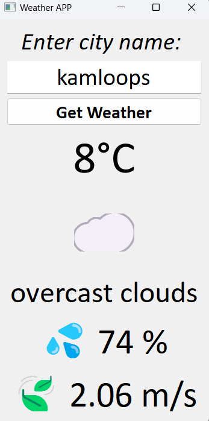

# weather_app

---
 <!-- Replace with your screenshot path -->

A lightweight desktop weather tool powered by OpenWeatherMap API.

---
## Features
- Real-time city weather lookup
- Temperature/Humidity/Wind speed display
- Weather condition emojis
- Auto error handling

## Quick Start

### Prerequisites
- Python 3.6+

### Install Dependencies
```bash
pip install PyQt5 requests
```
## API Setup

1. Go to OpenWeatherMap and sign up for a free account.

2. After logging in, navigate to the API section and get your API key.

3. Replace the api variable in WeatherApp class with your API key:

## Troubleshooting
- key issues: Ensure your API key is correctly added in the code. If you see "Unauthorized, Invalid API key", double-check the key.

- Invalid city name: If you see "City not found", ensure the city name is spelled correctly.

- Connection issues: If you encounter "Connection error", check your internet connection or firewall settings.

- Time-out errors: If you see a "timeout error", the API request may be taking too long. Try again later or check for server-side issues.

---

#### If you encounter any other issues, feel free to open an issue on the GitHub repository.